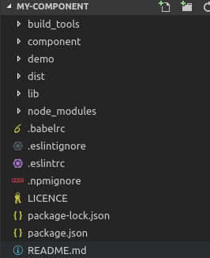

# Create rc component

Create react component app with no build coniguration

## Install

```js
npm i create-rc-component -g
```

## Create a component

```js
create-rc-component my-component
```
Waiting for initialization to complete  
```shell
cd my-component
```
After that you can get a dir like this   



**build_tools**   
Contains all configs for webpack and gulp   

**component**   
Put your component source code here   

**demo**   
Where you can test your component in browser    

**dist**   
The doc page with your component view  

**lib**   
The source code witch will be published to npm   


## Features

* React, JSX and ES6 support.
  ```js
  import React from 'react';

  export default function Test() {
    return (
      <div>test</div>
    );
  }
  ```
* Publish your component more easy.   
  ```shell
  npm publish
  ```

## License

Create rc component is open source software licensed as [MIT](https://github.com/changhuali/create-rc-component/blob/master/LICENCE).
